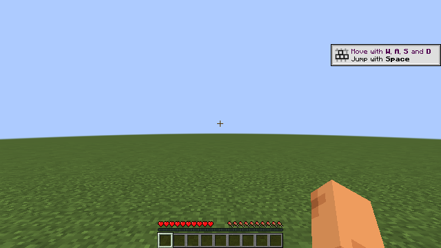

# Forge 1.20.6 真实图形客户端验证

正式 Forge 50.2.0 客户端与匹配专服使用同一 `0.5.0-dev` JAR：`eee8d545fdce4372dad51bfba4ae57159810267555077e6a2e73d21736c9f09a`。本轮持续通过报告后在线观察 **60.390 秒**，最后重新查询仍在线且为生存模式；客户端与专服均正常退出 0，原运行回执确认进程结束及端口释放。本次采集没有重新占用可能被后续测试使用的端口。

启动前后全部 **13 项严格默认配置及 42 条完整目录规则（38 DENY / 4 ALERT）**保持不变，没有为了真实客户端关闭 companion、device 或 VM DENY。设备关联按实际 scope 与安装标识独立复算，只公开匹配布尔值和计数，不公开 MachineGuid、安装 ID、scope 或设备摘要。

使用官方 ForgeBootstrap / `forge_client` 入口；官方安装器退出 0，4 个生成文件与独立原版输入均已核验，原版客户端按官方类路径保留。原始安装器日志、真实运行日志及实际执行 helper 原字节保留。Mixin 的 Java 17 兼容特征声明与 class major 65 相关警告，以及其它原始告警均保留在日志中，不用图形运行通过抹去。

截图经过 PNG CRC、640×360 尺寸及解压扫描线检查，并由 root Codex 代理实际查看、以 PNG SHA 绑定独立视觉记录。这不是用户人工正式验收，原 `formalAcceptancePassed=false` 保持不变。

[机器报告](../outputs/runtime-client-forge-1.20.6.json)列出 14 份、3,714,141 字节明确附件；[原运行回执](../outputs/runtime-client-forge-1.20.6/result.json)、[独立视觉记录](../outputs/runtime-client-forge-1.20.6/visual-review-root.json)保留原文。构建与包内 102 项检查见[构建报告](adapter-forge-1.20.6.md)。本报告不计入独立专服的 26 个 TCP 用例，不推断 Node 夹具先前失败的唯一原因，也不代表在线账号认证、Bukkit/跨加载器兼容、多人负载、攻防或性能验收。
